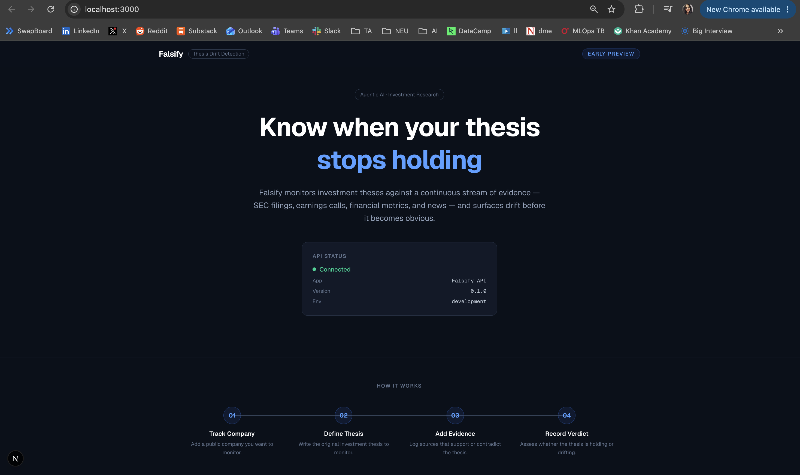
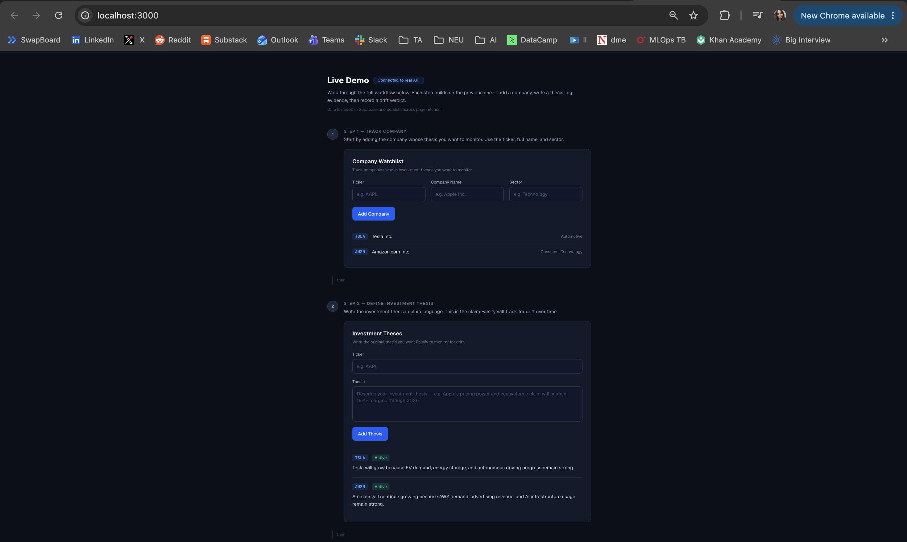
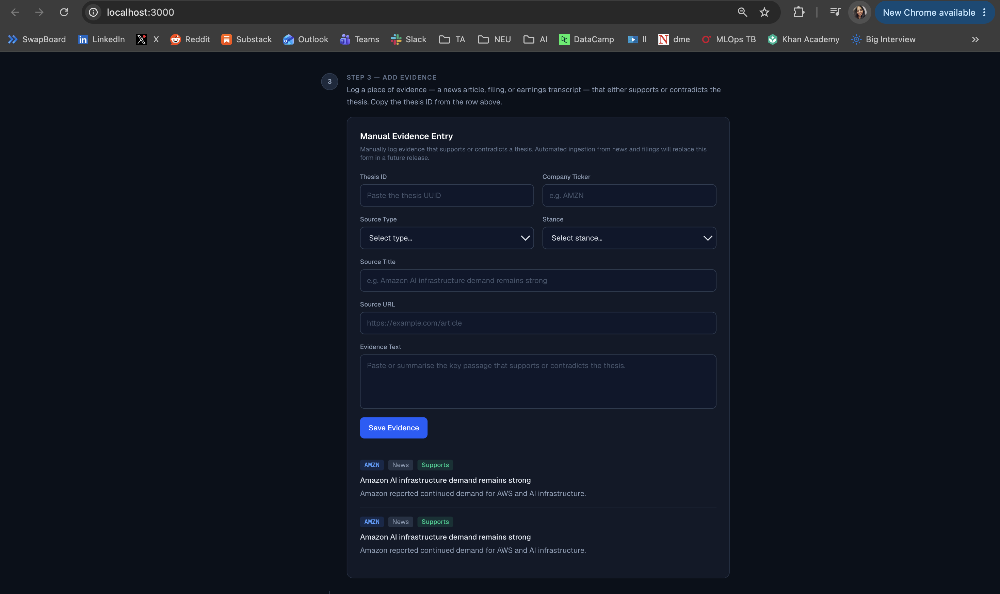
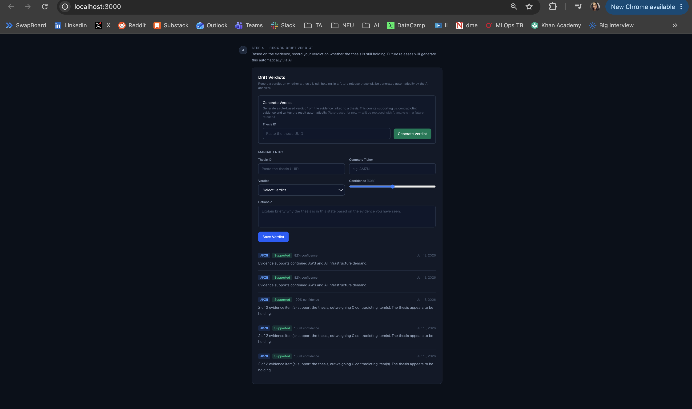
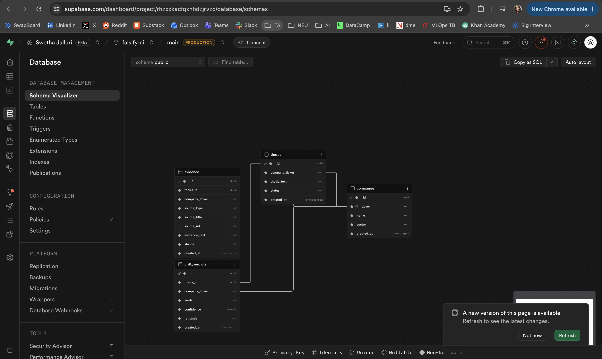

# Falsify

**Agentic AI platform for investment thesis drift detection.**

> Portfolio project — not financial advice. See [Disclaimer](#disclaimer).

---

## Problem

Investors buy a stock based on a thesis:

> "I believe Nvidia will continue growing because AI data center demand remains strong, margins stay high, and hyperscaler spending continues."

After investing, they rarely revisit that thesis systematically. Evidence accumulates — earnings calls, SEC filings, news — but nothing tells them whether their original reasoning still holds.

**Falsify tracks that evidence and tells you when a thesis is drifting.**

---

## What Falsify Does

1. You add a company to your watchlist and write a plain-English investment thesis.
2. You (or a future automated pipeline) attach evidence items — each tagged as `supports`, `contradicts`, or `neutral`.
3. Falsify runs a rule-based analyzer over that evidence and produces a structured **drift verdict**: `supported`, `contradicted`, `weakening`, or `needs_more_evidence`.
4. The verdict dashboard shows confidence, rationale, and history over time.

The current MVP uses a rule-based analyzer. The planned AI layer will replace it with LLM-grounded reasoning and automated evidence ingestion.

---

## Architecture

```
User
 ↓
Next.js Frontend
 ↓
FastAPI Backend
 ↓
Supabase Postgres
 ↓
Evidence + Rule-Based Analyzer
 ↓
Drift Verdict Dashboard
```

---

## Current MVP Features

- **Company Watchlist** — add and track public companies by ticker
- **Investment Thesis Entry** — write a plain-English thesis for any company
- **Manual Evidence Entry** — attach evidence with a stance (`supports` / `contradicts` / `neutral`)
- **SEC Financial Evidence Import** — fetch official financial facts from SEC EDGAR and store them as structured evidence rows; duplicate prevention on repeat imports
- **Rule-Based Drift Analyzer** — counts evidence stances, surfaces SEC fact counts separately, and computes a verdict with explainable rationale
- **Drift Verdict Dashboard** — view current verdict, confidence score, and sentence-by-sentence reasoning per thesis
- **REST API** — full CRUD for companies, theses, evidence, and verdicts, plus SEC lookup and demo endpoints

Falsify is not just a finance chatbot. It tracks whether an investment thesis is **supported**, **weakening**, **contradicted**, or **needs more evidence** based on structured evidence — starting with real SEC filings.

---

## Tech Stack

| Layer | Technology |
|---|---|
| Frontend | Next.js, TypeScript, Tailwind CSS |
| Backend | FastAPI, Pydantic v2, Python 3.11 |
| Database | Supabase Postgres |
| API style | REST |

---

## Database Tables

| Table | Purpose |
|---|---|
| `companies` | Tracked companies (ticker, name) |
| `theses` | Investment theses linked to a company |
| `evidence` | Evidence items linked to a thesis, each with a `stance` |
| `drift_verdicts` | Analyzer output: verdict, confidence, rationale, timestamp |

---

## Backend API Routes

| Method | Route | Description |
|---|---|---|
| `GET` | `/health` | Health check |
| `GET` | `/companies` | List all companies |
| `POST` | `/companies` | Add a company |
| `GET` | `/theses` | List all theses |
| `POST` | `/theses` | Create a thesis |
| `GET` | `/evidence` | List all evidence |
| `GET` | `/evidence/thesis/{thesis_id}` | Evidence for a thesis |
| `POST` | `/evidence` | Add an evidence item |
| `GET` | `/drift-verdicts` | List all verdicts |
| `GET` | `/drift-verdicts/thesis/{thesis_id}` | Verdicts for a thesis |
| `POST` | `/drift-verdicts` | Create a verdict manually |
| `POST` | `/analyze/thesis/{thesis_id}` | Run the rule-based analyzer |
| `GET` | `/sec/company/{ticker}` | Ticker-to-CIK lookup via SEC EDGAR |
| `GET` | `/sec/company/{ticker}/facts` | Available XBRL taxonomies and sample fact names |
| `GET` | `/sec/company/{ticker}/financial-summary` | Latest annual values for key us-gaap concepts |
| `POST` | `/sec/company/{ticker}/financial-evidence/{thesis_id}` | Import SEC financial facts as evidence rows (deduplication built-in) |
| `POST` | `/demo/seed-amzn` | Create or reuse AMZN demo company and thesis |
| `POST` | `/demo/run-amzn` | Run the full AMZN demo workflow end-to-end |

---

## Demo: Run the AMZN Thesis Drift Workflow

This demo runs the full Falsify workflow — from company setup to SEC evidence import to drift verdict — in one command.

### 1. Start the backend

```bash
cd apps/api
uvicorn main:app --reload
```

API runs at `http://localhost:8000`. Swagger UI at `http://localhost:8000/docs`.

### 2. Start the frontend

```bash
cd apps/web
npm run dev
```

Dashboard runs at `http://localhost:3000`.

### 3. Run the full AMZN demo

```bash
curl -X POST http://localhost:8000/demo/run-amzn
```

This single endpoint:

1. **Creates or reuses** the AMZN demo company and thesis in Supabase
2. **Fetches real SEC financial facts** for Amazon from the SEC EDGAR XBRL API
3. **Stores them as structured evidence rows** — each fact becomes one evidence item linked to the thesis
4. **Skips duplicates** — calling it again will not double-insert evidence
5. **Generates a drift verdict** — analyzes all evidence by stance, counts SEC fact rows separately, and writes an explainable rationale

Example response:

```json
{
  "message": "AMZN demo run complete.",
  "company": { "ticker": "AMZN", "name": "Amazon.com, Inc.", ... },
  "thesis": { "thesis_text": "Amazon will continue strengthening because AWS...", ... },
  "evidence_import": {
    "created_evidence_count": 6,
    "skipped_duplicate_count": 0
  },
  "verdict": {
    "verdict": "needs_more_evidence",
    "confidence": 0.0,
    "rationale": "Analyzed 6 evidence row(s): 0 supporting, 0 contradicting, 6 neutral. 6 row(s) came from SEC financial facts. SEC financial evidence is treated as factual context..."
  }
}
```

### 4. View results in the dashboard

Open `http://localhost:3000` and scroll through the workflow:

- **Step 2** — the AMZN thesis appears in the Investment Theses panel with an "Import SEC Financial Evidence" button
- **Step 3** — SEC financial fact rows appear in the Evidence Panel (revenues, net income, assets, etc.)
- **Step 4** — the Drift Verdict panel shows the verdict, confidence, and sentence-by-sentence reasoning

To move the verdict from `needs_more_evidence` to `supported` or `contradicted`, add manual evidence items tagged `supports` or `contradicts` in Step 3, then click **Generate Verdict** again.

---

## How to Run Locally

### Prerequisites

- Python 3.11+
- Node.js 18+
- A [Supabase](https://supabase.com) project (free tier works)

### 1. Clone the repo

```bash
git clone https://github.com/your-username/falsify-ai.git
cd falsify-ai
```

### 2. Backend

```bash
cd apps/api
python -m venv .venv
source .venv/bin/activate      # Windows: .venv\Scripts\activate
pip install -r requirements.txt
cp .env.example .env            # fill in your Supabase credentials
uvicorn main:app --reload
```

API runs at `http://localhost:8000`. Swagger docs at `http://localhost:8000/docs`.

### 3. Frontend

```bash
cd apps/web
npm install
cp .env.local.example .env.local   # fill in NEXT_PUBLIC_API_URL
npm run dev
```

Frontend runs at `http://localhost:3000`.

---

## Environment Variables

### Backend (`apps/api/.env`)

```
SUPABASE_URL=your_supabase_project_url
SUPABASE_SERVICE_ROLE_KEY=your_service_role_key
```

### Frontend (`apps/web/.env.local`)

```
NEXT_PUBLIC_API_URL=http://localhost:8000
```

Never commit real credentials. Both files are gitignored.

---

## Screenshots

> Screenshots are not yet committed. Add the files listed below to `docs/screenshots/` manually, then these images will render on GitHub.

### Dashboard Overview



### Company and Thesis Workflow



### Evidence Panel



### Drift Verdict and Generate Verdict



### Supabase Database Tables



---

## Roadmap

- [ ] **LLM-based analyzer** — replace rule-based verdict logic with LangGraph agent + Claude
- [ ] **Automated evidence ingestion** — pull from SEC EDGAR filings, earnings call transcripts, financial news
- [ ] **Financial metrics pipeline** — revenue growth, margins, guidance deltas
- [ ] **Citation-grounded verdicts** — each verdict links back to source documents
- [ ] **Thesis pillar decomposition** — break a thesis into sub-claims and evaluate each separately
- [ ] **Verdict history timeline** — track how a thesis verdict changes over time
- [ ] **Agent observability** — trace and evaluate LLM reasoning steps (LangSmith)
- [ ] **Hallucination detection** — automated checks on LLM-generated rationale

---

## Disclaimer

This is a portfolio and learning project. It does not provide financial advice, investment recommendations, or buy/sell signals. Nothing in this codebase should be interpreted as guidance on any real investment decision.
